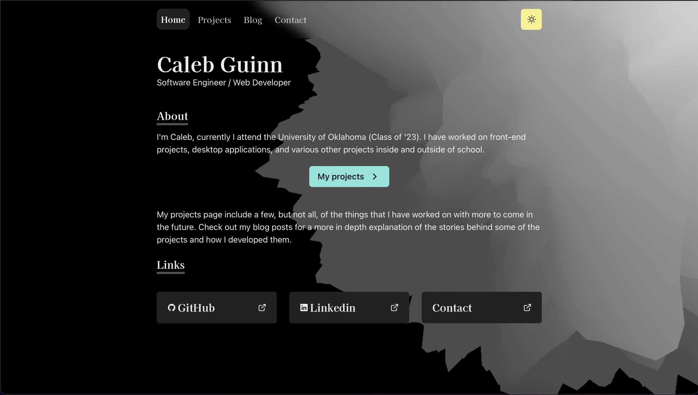

# calgui.io

- **Framework**: [Next.js](https://nextjs.org/)
- **Deployment**: [Vercel](https://vercel.com)
- **Styling**: [Chakra UI](https://chakra-ui.com)
- **Analytics**: [Vercel Analytics](https://vercel.com/analytics)
- **Message Handling**: [Sendgrid](https://sendgrid.com)
- **Animations**: [Framer Motion](https://www.framer.com/motion/)
- **3D Blob**: [Three.js](https://threejs.org)



## How to set it up

```bash
git clone https://github.com/calgui1/calgui.io.git
cd calgui.io
npm install
npm run dev
```

When running locally, you have the choice to remove the SendGrid API or use your own token in a .env file at the root of the project. The contact page will function without one, messages will not go anywhere however.